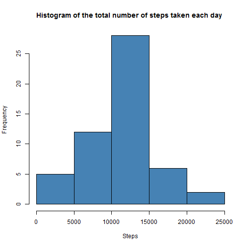
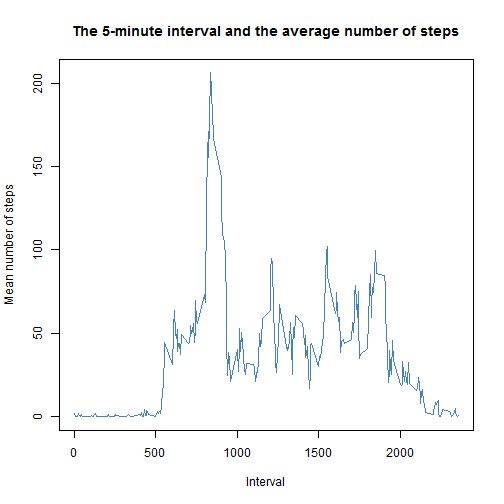
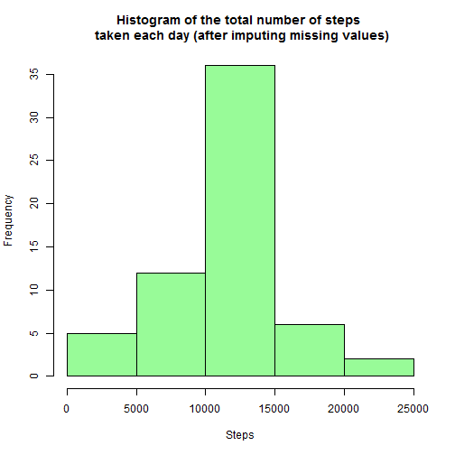
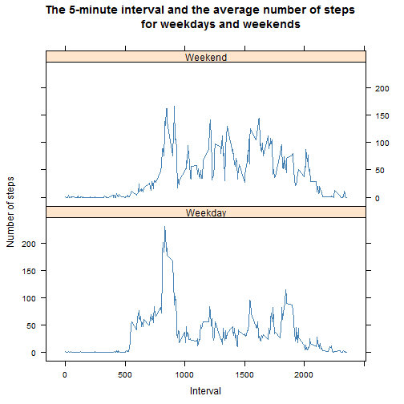

# PA1_template

## Loading and preprocessing the data

1. Reading the data:


```r
download.file("https://d396qusza40orc.cloudfront.net/repdata%2Fdata%2Factivity.zip", 
              destfile = "Activity_Monitoring_Data.zip", mode = "wb")
dataset_unz <- unzip("Activity_Monitoring_Data.zip")
dataset_total <- read.csv(dataset_unz)
```

2. Prepare dataset without missing values:


```r
dataset <- dataset_total[complete.cases(dataset_total$steps), ]
```

## Calculate mean total number of steps taken per day

1. Calculate the total number of steps taken per day


```r
total_steps_per_day <- aggregate(steps ~ date, data = dataset, sum)
```

2. Histogram of the total number of steps taken each day


```r
hist(total_steps_per_day$steps, col = "steelblue", xlab = "Steps", 
     main = "Histogram of the total number of steps taken each day ")
```

 

3. Calculate and report the mean and median of the total number of steps taken per day

Mean of the total number of steps taken per day:


```r
mean_steps_per_day <- mean(total_steps_per_day$steps)
mean_steps_per_day
```

```
## [1] 10766.19
```

The median of the total number of steps taken per day:


```r
median_steps_per_day <- median(total_steps_per_day$steps)
median_steps_per_day
```

```
## [1] 10765
```

## The average daily activity pattern

1. Time series plot of the 5-minute interval (x-axis) and the average number of steps taken, averaged across all days (y-axis)


```r
avg_steps_per_5_min <- aggregate(steps ~ interval, data = dataset, mean)
plot(avg_steps_per_5_min$interval, avg_steps_per_5_min$steps, type = "l", xlab = "Interval", 
     ylab = "Mean number of steps",
     main = "The 5-minute interval and the average number of steps", col = "steelblue")
```

 

2. 5-minute interval, on average across all the days in the dataset, with the maximum number of steps


```r
avg_steps_per_5_min[avg_steps_per_5_min$steps == max(avg_steps_per_5_min$steps), 
                    'interval']
```

```
## [1] 835
```

## Imputing missing values

1. The total number of missing values in the dataset


```r
sum(is.na(dataset_total$steps))
```

```
## [1] 2304
```

2. A strategy for filling in all of the missing values in the dataset: the mean for that 5-minute interval. 


```r
na_fulfill <- aggregate(steps ~ interval, data = dataset_total, mean, na.rm = TRUE)
```

3. Create a new dataset that is equal to the original dataset but with the missing data filled in.


```r
dataset_na <- subset(dataset_total, is.na(steps))
dataset_with_na_raw <-  merge(dataset_na, na_fulfill, by="interval", all.x = TRUE, suffixes = c(".x", ""))
dataset_with_na_raw2 <- dataset_with_na_raw[, c("interval", "date", "steps")]
dataset_with_na <- rbind(dataset, dataset_with_na_raw2)
```

4. A histogram of the total number of steps taken each day


```r
total_steps_per_day_na <- aggregate(steps ~ date, data = dataset_with_na, sum)
hist(total_steps_per_day_na$steps, col = "palegreen", xlab = "Steps", 
     main = "Histogram of the total number of steps \n taken each day (after imputing missing values)")
```

 

5. Calculate and report the mean and median total number of steps taken per day

Mean of the total number of steps taken per day:


```r
mean_steps_per_day_na <- mean(total_steps_per_day_na$steps)
mean_steps_per_day_na
```

```
## [1] 10766.19
```

The median of the total number of steps taken per day:


```r
median_steps_per_day_na <- median(total_steps_per_day_na$steps)
median_steps_per_day_na
```

```
## [1] 10766.19
```

6. Comprison of these values with the estimates from the first part of the assignment:


```r
diff_mean = mean_steps_per_day_na - mean_steps_per_day
diff_mean
```

```
## [1] 0
```

```r
diff_median = median_steps_per_day_na - median_steps_per_day
diff_median
```

```
## [1] 1.188679
```

The mean value didn't change after imputing missing values. 
The median increased slightly. 

7. What is the impact of imputing missing data on the estimates of the total daily number of steps:

Values between 10000 and 15000 are more frequent after the imputing of missing values than before.


## Are there differences in activity patterns between weekdays and weekends?

1. Creation of the new factor variable in the dataset with two levels – “weekday” and “weekend” indicating whether a given date is a weekday or weekend day.


```r
Sys.setlocale("LC_TIME", "English")
```

```
## [1] "English_United States.1252"
```

```r
dataset_with_na$day <- weekdays(as.Date(dataset_with_na$date), abbreviate = FALSE)
dataset_with_na$day_type <- ifelse(dataset_with_na$day %in% c("Sunday", "Saturday"), "Weekend", "Weekday")
dataset_with_na <- transform(dataset_with_na, day_type = factor(day_type))
```

2. A panel plot containing a time series plot of the 5-minute interval (x-axis) and the average number of steps taken, averaged across all weekday days or weekend days (y-axis)


```r
dataset_with_na_aggr <- aggregate(steps ~ interval + day_type, data = dataset_with_na, mean)
library(lattice)
g <- xyplot(steps ~ interval | day_type, data = dataset_with_na_aggr, layout = c(1, 2), type = 'l',  
           col = "steelblue", xlab = "Interval", ylab = "Number of steps", 
           main = "The 5-minute interval and the average number of steps 
            for weekdays and weekends") 
print(g)
```

 
